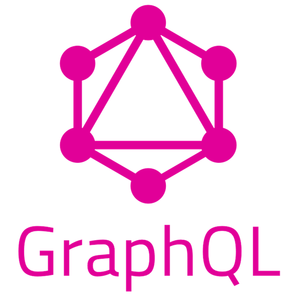
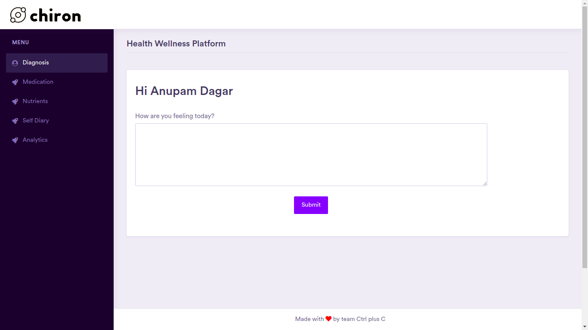
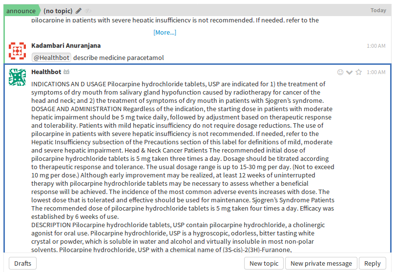

## Problem Statement
There is limited preventive healthcare and services to promote optimal health and wellness, and an avert worsening of one's healthy mind and body. Through this product we aim to make you "Not just disease free but also healthy".

## Inspiration
Chiron, the wisest centaur from Greek lore is said to have all of Apollo's teachings of medicines and herbs, a prodigy to surpass his teacher. In the same way we developed our own Chiron with the ability to surpass the existing e-healthcare platform.

## About Chiron
Chiron tackles this by seamlessly integrating various healthcare and wellness solutions into a single, succint web app. Chiron is more than just an assistant or Diagnostics tool. Unlike conventional market tools, it personalises your experience keeping a track of your wellness, physical & mental health, nutritional needs and actually cares.

## Current Product
Whether it be the description of medicines to prevent wrong dosage or the diagnosis of a disease, Chiron is there for you. Chiron keeps track of your daily deitary intake, and runs analytics to suggest possible changes in your diet plan. The web app operates in parallel to a forum of the same name, which allows users to interact with each other sharing their stories, acting as motivation for those patients who may be struggling to overcome similar issues. Chiron encourages its users to maintain a SelfCare Diary. By running Tonal Analysis on these, Chiron also keeps track of the user's mental health. Further more, for ease of access and usage Chiron is also available in the form of a Zulip Healthbot. The backend server is implemented in django's REST framework. The forum is made using Hasura's GraphQL Engine and React. The frontend is made in JQuery.

## Tech Stacks
React|Django|GraphQL|Hasura|Zulip|Python|JavaScript|
:---:|:----:|:-----:|:----:|:---:|:----:|:--------:|
|||||||

## Usage
 ### Steps to Web APP
* Create a virtual environment  
`virtualenv venv`
`source venv/bin/activate`
* Install all requirements  
`pip install -r 'requirements.txt'`
* Do the migrations by running  
`python manage.py migrate`
* Create a superuser by running  
`python manage.py createsuperuser`
* Run the server  
`python manage.py runserver`
* Head over to `http://127.0.0.1:8000/` to start using Chiron.

 ### Steps to Run Zulip BOT
* Create a zulip realm on [https://zulipchat.com](https://zulipchat.com)
    - Create a Bot on zulip.
    - Go to settings from the gear menu in the top right corner.
    - Create a new generic bot from `Your bots`.
    - Download the bot's zuliprc and save it in your home directory as `.zuliprc`.
* Run the Bot using `python3 bot.py`.

Developed by Ctrl-plus-C for Hack36 2019
## Contributors
1. [Kadambari Anuranjana](https://github.com/Aotoge)
2. [Anupam Dagar](https://github.com/Anupam-dagar)
3. [Anshu Yadav](https://github.com/Anshu-ros)
4. [Lekhika Dugtal](https://github.com/CleverFool77)
